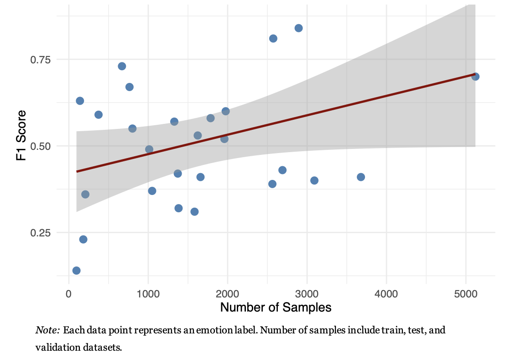
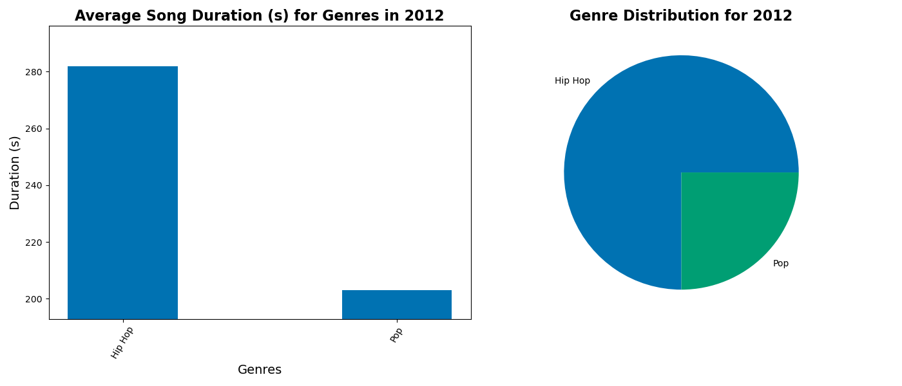
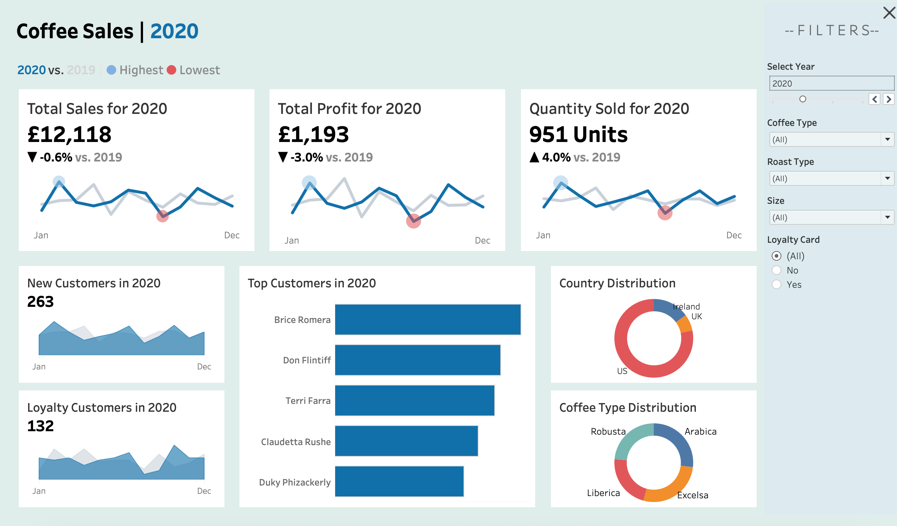

# Alfie's Data Science Portfolio

# [Project 1: Fine-grained Sentiment Analysis](https://www.github.com/acaudwell03/sentiment_analysis)

## Project Overview
This project compares **traditional machine learning, deep learning, and transformer-based models** for **fine-grained sentiment analysis** across 27 distinct emotions using the GoEmotions dataset by Google Research.

The models evaluated were:
* **Random Forest (RF)** – baseline traditional approach
* **Convolutional Neural Network (CNN)** – custom deep learning model
* **RoBERTa** – pre-trained transformer fine-tuned on emotion labels
The goal was to understand how each type of model handles nuanced emotional expressions and dataset imbalances, providing actionable insights for business and research applications in NLP.

## Key Results
| Model             | Avg. F1-Score | Notes                                                |
| :---------------- | :------------ | :--------------------------------------------------- |
| **Random Forest** | 0.47          | **Robust** with small or imbalanced datasets             |
| **CNN**           | 0.49          | Learns **basic semantic structures**, limited context    |
| **RoBERTa**       | **0.54**      | Best overall performance; captures **contextual nuance** |

<br>

* Performance **positively correlated** with sample size (r = 0.284)
* RoBERTa effectively identified subtle distinctions between similar emotions (e.g., love vs joy)

## Visual Results

### Model Performance by Emotion
| Emotion         | RF   | CNN  | RoBERTa | Average |
|-----------------|------|------|----------|----------|
| Admiration      | 0.68 | 0.69 | **0.74** | 0.70 |
| Amusement       | 0.82 | 0.82 | **0.87** | 0.84 |
| Anger           | 0.49 | 0.51 | **0.57** | 0.52 |
| Annoyance       | 0.40 | 0.40 | 0.40 | 0.40 |
| Approval        | 0.38 | 0.37 | **0.49** | 0.41 |
| Caring          | 0.39 | 0.43 | **0.44** | 0.42 |
| Confusion       | 0.34 | 0.36 | **0.52** | 0.41 |
| Curiosity       | 0.29 | 0.32 | **0.68** | 0.43 |
| Desire          | 0.54 | **0.57** | 0.55 | 0.55 |
| Disappointment  | 0.26 | 0.31 | **0.37** | 0.31 |
| Disapproval     | 0.28 | 0.35 | **0.53** | 0.39 |
| Disgust         | 0.45 | 0.50 | **0.51** | 0.49 |
| Embarrassment   | 0.58 | **0.67** | 0.51 | 0.59 |
| Excitement      | 0.30 | 0.35 | **0.47** | 0.37 |
| Fear            | 0.63 | 0.69 | **0.70** | 0.67 |
| Gratitude       | 0.90 | **0.93** | **0.93** | 0.92 |
| Grief           | **0.31** | 0.12 | 0.00 | 0.14 |
| Joy             | 0.54 | 0.59 | **0.61** | 0.58 |
| Love            | 0.78 | 0.82 | **0.83** | 0.81 |
| Nervousness     | 0.29 | 0.37 | **0.42** | 0.36 |
| Optimism        | 0.58 | **0.63** | 0.59 | 0.60 |
| Pride           | 0.64 | **0.67** | 0.58 | 0.63 |
| Realization     | **0.32** | 0.34 | 0.31 | 0.32 |
| Relief          | 0.22 | 0.19 | **0.27** | 0.23 |
| Remorse         | 0.74 | **0.78** | 0.66 | 0.73 |
| Sadness         | 0.50 | 0.50 | **0.60** | 0.53 |
| Surprise        | 0.54 | 0.57 | **0.64** | 0.57 |

> **Note:** Bold values indicate the best result for each emotion.

<br>

* **Gratitude (0.92)** was the **highest-scoring** emotion; **Grief (0.14)** the **lowest**.
* Performance was tied closely to emotion frequency within the dataset.

<br>

<p align="center">  </p>

## Methodology
### Data
* **Dataset**: GoEmotions (27 emotions)
* **Preprocessing**: Tokenisation, TF-IDF, Word Embeddings, Stopword Removal, Stemming, Multi-Hot Encoding
* **Split**: Train (70%), Validation (15%), Test (15%)

### Models
* **Random Forest** (scikit-learn) → Optimised with Random Search
* **CNN** (PyTorch) → 1D convolutional layers, dropout, embedding layer → Bayesian Optimization for tuning
* **RoBERTa** (Hugging Face Transformers) → Pre-trained on the dataset, Adam, and learning rate scheduling

### Evaluation
* **F1-score** (macro)
* **Correlation** between sample size & model performance
* **ANOVA** with Greenhouse–Geisser correction + Holm pairwise comparisons
* **SHAP** for interpretability

## Statistcial Findings
* **ANOVA**: F(1.26, 32.76) = 5.04, **p = 0.024** → **significant model effect**
* **Pairwise comparisons**:
  * RF vs DL: marginally non-significant (p ≈ 0.054)
  * CNN vs RoBERTa: not significant (p = 0.096)
* **Spearman's Rho**: **r = 0.284** → **weak positive** correlation between sample size & performance
### Correlation Between Sample Size and Avergage Performance
<p align="center">  </p>

* **Interpretation**: **RoBERTa performs best**, though differences are moderate due to sample imbalance.

## Insights & Applications
* **Business impact**: Detect nuanced emotions in **reviews, social media posts, or chatbots**.
* **Model choice**:
  * Use **RF for small** or imbalanced datasets
  * Use **Transformers (RoBERTa) for large-scale**, context-rich data
* **Future work**:
  * Evaluate **multilingual** or cross-platform data
  * Improve class balance via **data augmentation**
  * Deploy as an **interactive app** for real-time emotion detection

## Tech Stack
**Languages**: Python, R
<br>
**Libraries**: scikit-learn, PyTorch, Transformers, Optuna, SHAP, Pandas, Matplotlib, Seaborn
<br>
**Tools**: Jupyter Notebook, RStudio, VS Code

<br>

# [Project 2: Music Data Exploration & Insights](https://github.com/acaudwell03/music_eda)
## Project Overview
This project explores a **music database** to analyse trends in song popularity, genres, artists, and audio features such as danceability, energy, and tempo.
It demonstrates skills in **data cleaning**, **SQL database design**, **Python-based analysis**, and **visual presentation** — showing how **raw datasets** can be transformed into **actionable insights** for the music industry.

## Objectives
* Create and populate a **SQLite database** from raw CSV music data
* **Clean and preprocess** data for analysis
* Perform **exploratory data analysis (EDA)** using SQL and Python
* **Identify** relationships between song features and popularity
* **Visualize patterns** in genre trends and artist performance

## Methodology
### Data Processing
* Loaded raw **Spotify-like dataset** (songs.csv)
* Renamed and standardized column names
* Filtered songs using conditions such as:
 * **popularity** > 50
 * **speechiness** between 0.33 and 0.66
 * **danceability** > 0.20
* Stored the cleaned data into an SQLite database (CWDatabase.db)
### Database Design
#### Tables created:
* **songs** – includes track name, artist, popularity, and key features
* **artists** – stores artist metadata
* **genres** – genre-level mapping
* **song_features** – normalized audio characteristics
  
<br>

## Example SQL Query

<br>

```sql
-- Takes the selected artist and fetches genre-popularity data from the SQLite database,
-- along with the average overall genre-popularity.

 SELECT
     g.Genre,
     AVG(CASE
             WHEN LOWER(REPLACE(a.ArtistName, " ", "")) LIKE ?
             THEN s.Popularity
             ELSE NULL
         END) AS Artist_Popularity,
     AVG(s.Popularity) AS Overall_Popularity
 FROM Song s
 JOIN Artist a ON s.ArtistID = a.ID
 JOIN Song_genre sg ON s.ID = sg.SongID
 JOIN Genre g ON sg.GenreID = g.ID
 GROUP BY g.Genre
 ORDER BY Overall_Popularity ASC;
```

<br>

## Example of Visualisation from a Selected Year


<br> 

## Future Improvements
* Add **interactive dashboard**
* Integrate **Spotify API** for real-time data
* Apply **machine learning** to predict song popularity based on features

<br>

## Tech Stack
**Languages**: Python, SQL
<br>
**Libraries**: Pandas, Numpy, SQLite3, Matplotlib
<br>
**Tools**: Jupyter Notebook, VS Code, DBBrowser

<br>

# [Project 3: Coffee Sales Dashboard](https://public.tableau.com/views/cafesales_17633890336060/Dashboard1?:language=en-GB&publish=yes&:sid=&:redirect=auth&:display_count=n&:origin=viz_share_link)
## Project Overview
This project creates **interactive** and **dynamic** visualisations for cafe with coffee sales data, including KPIs, country distributions, and new customer frequency.
It demonstrates skills in **Tableau**, using relationships to relate Excel Sheets, calculated fields, filtering, and eye-catching visuals to give the user important information about the cafe performance across time.

<br>

## Dashboard Preview
<p align="center">  </p>

<br>

## Objectives
* Connect Tableau to an Excel data source containing data on products, orders, and customers
* Prepare the data fields, alter aliases, and ensure all datatypes are correct
* Create **KPI vizzes** that show **Sales, Profit, and Quantity Sold** over a **selected year**
* Compare KPIs to the **previous year**
* **Explore** other important data to show on the dashboard
* **Add filters** to all vizzes and allow **interactivity** for more control
* Create an **eye-catching and engaging dashboard** for **desktops and phones**

## Methodology
### Preparing Data Sources
* Loaded Excel workbook containing product, order, and customer data
* Built relationships across sheets using order_id, customer_id, and product_id
* Cleaned fields, updated aliases, and corrected datatypes for consistent modelling
### KPIs
* Created a user-selected year parameter
* Built calculated fields for Current Year (CY) vs Previous Year (PY) metrics (Sales, Profit, Quantity)
* Developed monthly line charts visualising CY performance with PY comparison overlays
* Added dynamic titles and % change indicators to highlight trends
* Formatted visuals for clarity and consistency
### New Customer/Loyal Customer Graphs
* Created calculated fields to classify customers as new or returning
* Built monthly trend charts showing growth in new customers and loyalty patterns
* Added tooltips and filters to allow deeper exploration of customer behaviour
### Country & Coffee Type Distribution Charts
* Designed donut chart showing geographical distribution of customers
* Built breakdowns by coffee type to identify top-selling categories
* Applied interactive filters for year, country, and product type
### Top 5 Customer Graph
* Created ranked bar chart for top 5 customers
* Linked filters so rankings update dynamically based on selected year or category


  


